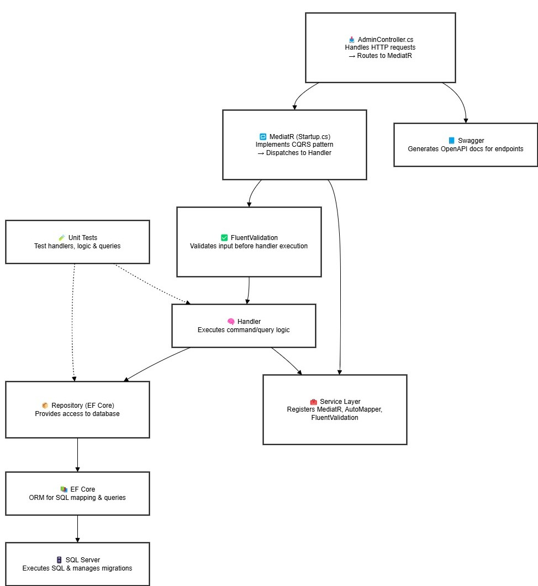
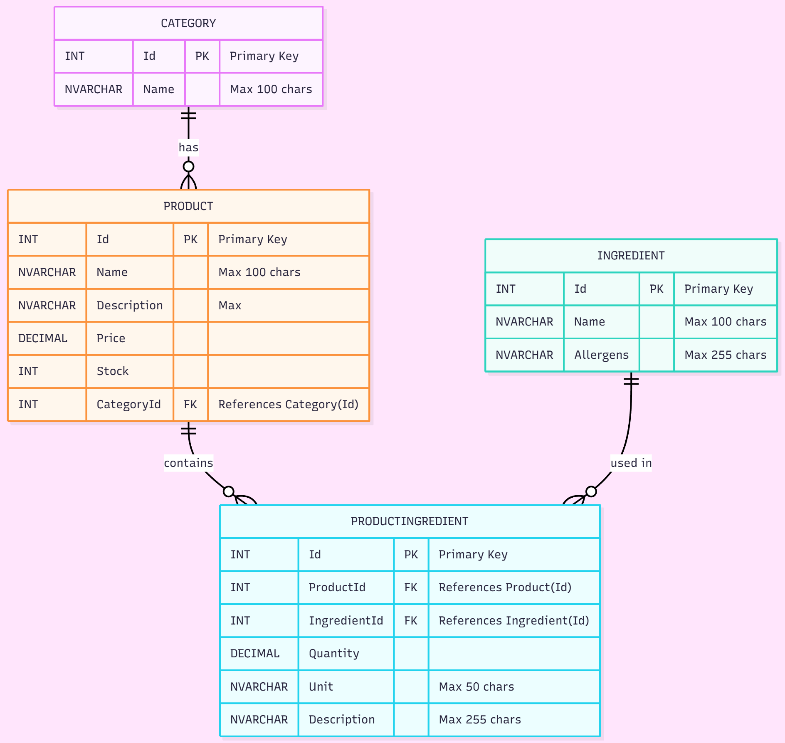

# ☁️ Backend Web API – Built With ASP.NET Core & Clean Architecture

This backend project focuses on building a well-structured, scalable API using **ASP.NET Core**, **C#**, **SQL Server**, secure, scalable, and cloud-integrated using **Azure**. With an emphasis on clean code, architecture patterns, and testing, the project demonstrates how to create robust backend solutions ready for production environments.

---

# 🔍 Overview

This API handles:

- CRUD operations for core entities like products, categories, and ingredients
- Validation, versioning, and documentation of endpoints
- Secure and maintainable backend logic
- Scalable architecture using modern design patterns
- **Cloud deployment** with Azure SQL and secure identity-based access

---
## 📊 Architecture Overview

The diagram below illustrates the structure of the backend application, following a clean architecture and CQRS pattern.

---
## 🍰 Database Schema Overview

The diagram below illustrates the BakeryStoreBackend data model, showing how products, categories, and ingredients are related through a normalized relational structure.

It helps visualize the many-to-many relationship between Product and Ingredient via the ProductIngredient table, and the one-to-many relationship between Category and Product.

---

## 🧠 What I Learned

This project helped me:

- Strengthen my backend development skills in C# and .NET
- Structure scalable APIs using CQRS, MediatR, and the Repository Pattern
- Manage database design, migrations, and advanced LINQ queries with EF Core
- Implement Swagger documentation and versioning for APIs
- Write unit and integration tests with xUnit and mocking frameworks
- Set up CI/CD pipelines using GitHub Actions
- **Move a local SQL database to the Azure cloud and configure it for secure access using Microsoft Entra ID and `Microsoft.Data.SqlClient`**
- **Access and manage the cloud database using SSMS and Azure CLI**

---

## 🔐 Backend Architecture

The API is built using the following tools and principles:

- **ASP.NET Core & C#** – building RESTful APIs with routing, middleware, and DI
- **Entity Framework Core** – querying and migrating SQL Server databases
- **MediatR & CQRS** – for separating business logic and enabling maintainability
- **Repository Pattern** – abstracting data access and improving testability
- **AutoMapper** – mapping between domain models and view models
- **FluentValidation** – handling request validation cleanly and declaratively
- **Microsoft Entra ID (Azure AD)** – for secure authentication when connecting to the database
- **Microsoft.Data.SqlClient** – for identity-based access to Azure SQL

---

## 🧱 Database & Schema

- **Azure SQL Database** – cloud-hosted relational database for scalability and reliability
- Designed normalized schemas (e.g., `Product`, `Category`, `Ingredient`)
- Managed schema updates and data integrity using EF Core migrations

---

## 📡 API Features

- RESTful API with proper HTTP methods (`GET`, `POST`, `PATCH`, `DELETE`)
- API versioning to support future upgrades
- OpenAPI docs with Swagger, customized for clarity
- Centralized error handling with meaningful status codes

---

## 🧪 Testing & Reliability

- Unit testing of business logic (commands, handlers, queries) using **xUnit**
- Integration tests for database + API interaction
- Mocking frameworks for isolating test dependencies

---

## ⚙️ DevOps & Deployment

- **Git** for version control
- **GitHub Actions** for CI/CD
- Ready to deploy to cloud or on-prem environments

---

## 🚀 Getting Started

To run this project locally:

1. Clone the repository
2. Log in to Azure via CLI:
  `az login`
3. Set up the database connection string using Microsoft Entra ID authentication.
   `appsettings.json or appsettings.Development.json`
4. Apply EF Core migrations:
  `dotnet ef database update`
5. Restore and build the API:
  `dotnet restore` then `dotnet build`
6. Run the API
   `dotnet run`
7. Access Swagger UI at https://localhost:<port>/swagger to explore the API.
8. Run tests
    `cd Application.Tests
     dotnet test`

---

## 📦 Other Highlights

- Pagination and filtering for large datasets (`SearchBakeryProductQuery`)
- Custom reusable extensions (e.g., `PaginationExtension`)
- HTTPS enforcement and HSTS for secure communication
- Clear documentation for API setup and usage

---

## 🛍️ Domain Knowledge

This project simulates a small e-commerce backend and includes:

- Inventory and pricing logic
- Category management
- View Models like `BakeryProductViewModel`, `BakeryCategoryViewModel` to shape data for client-side use

---

> 💬 This project is currently under active development and will continue to evolve. Feedback or collaboration ideas? Feel free to reach out!
